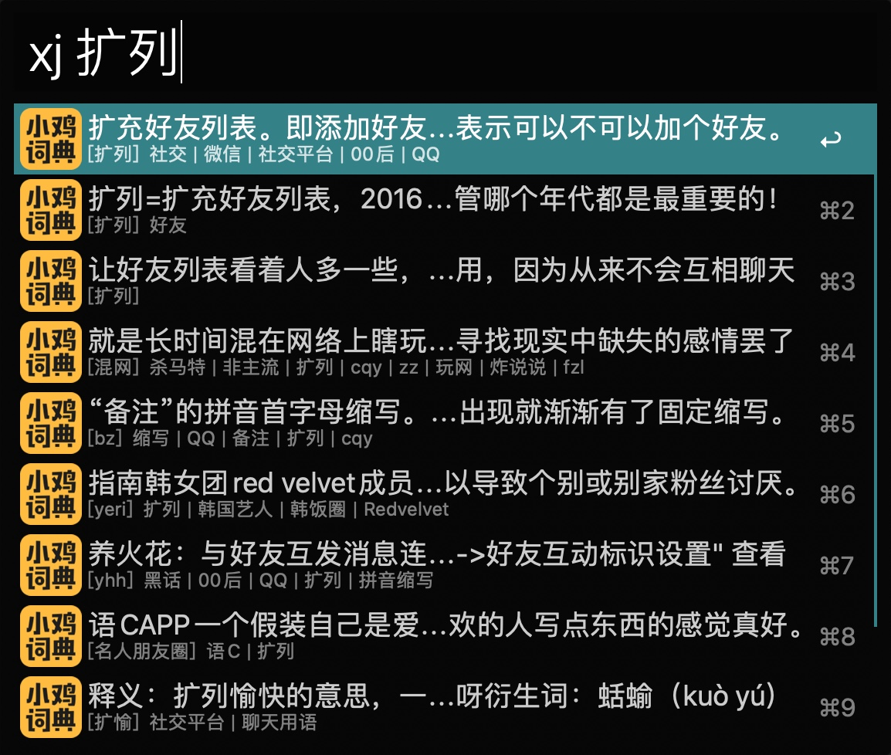
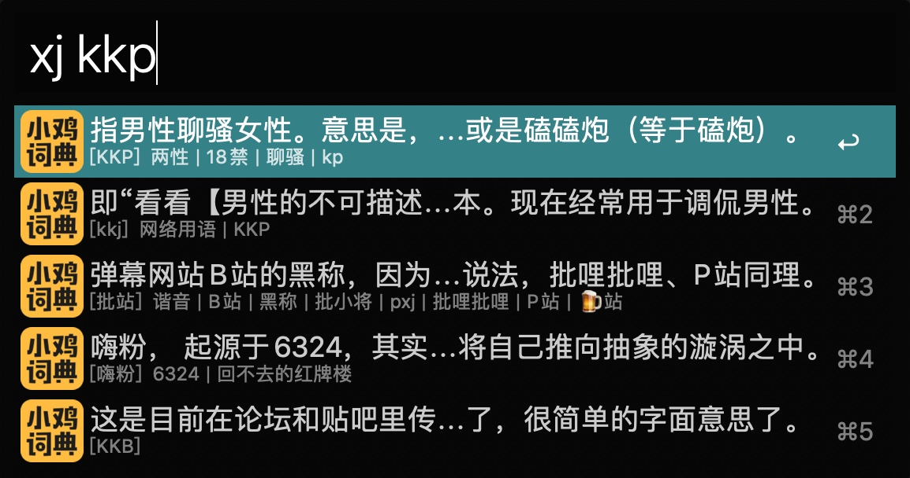

# 小鸡词典
##### 咯咯咯

> 天道好轮回，苍天绕过谁。80/90 后的叔叔阿姨们终于到了看不懂 00/10 后缩写/造词/黑话的年纪了。

## 如何使用
1. 先在你的 macOS 系统上装好 **`Alfred`**
2. 下载好本插件 [下载链接](https://github.com/onekb/jikipedia-alfred-workflows/releases/download/1.0/jikipedia.alfredworkflow)
3. 双击安装
4. 快捷键召唤你的 **`Alfred`** 输入 `xj {关键字}`
5. 回车即可到达详细百科

> 使用全世界最好的语言——php 编写。为考虑到使用人群范围，composer 扩展也一起打包了，开箱即用。

